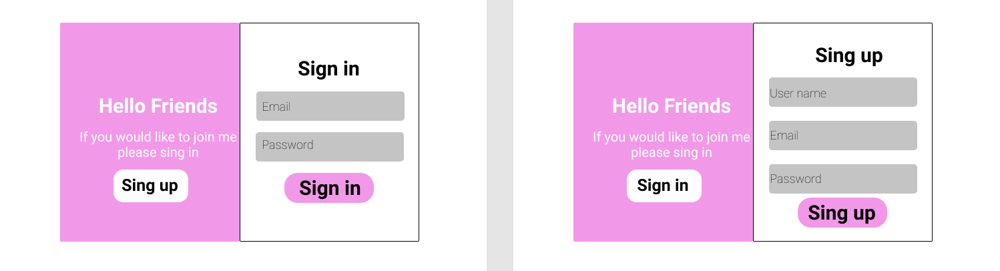

# Workshop Create form sign in and sign up

### สิ่งที่ได้เรียนรู้
1. [การออกแบบ Form ด้วย Figma](https://www.figma.com/file/0CAGx5FQRWAcgpTzrCmkKb/Login-Form)
2. [html](#html)
3. [css](#css)
4. [javaScript](#javaScript)

### ภาพของโปรเจคนี้


### html 
1. การสร้างฟอร์ม
    * placeholder คือ ให้ข้อความที่เราต้องการไปอยู่ในช่อง Form 
    * type of input
        * text
        * password
        * email  

ซึ่งจากการลงมือทำในครั้งนี้จะเห็นว่า การวางโครงสร้างของ html เป็นเรื่องที่สำคัญเป็นอย่างมาก ถ้าหากเราวางโครงสร้างไม่ถูกต้อง เวลาที่เรา แสดงผลจะทำให้ โปรแกรมแสดงผลผิดพลาด  และทำให้เกิด Error ได้นั้นเอง

### Example code 1:
```html
    <div class="container">
        
    </div>
```
### Example code 2: 
```html
    <div class="container">
        <div class="form-container">
            <!-- Form signin -->
            <div class="signin">
                <form action="#" class="form-sign-in">
                  <h1>Sign In</h1>
                  <input type="text" placeholder="Username" />
                  <input type="password" placeholder="Password" />
                  <a href="#">Forgot your password?</a>
                  <button class="btn btn-form">SIGN IN</button>
                </form>
            </div>

            <!-- Form signup -->
            <div class="signup">
                <form action="#" class="form-sign-up">
                    <h1>SIGN UP</h1>
                    <input type="text" placeholder="Username">
                    <input type="email" placeholder="email">
                    <input type="password" placeholder="password">
                    <button class="btn btn-form">SIGN UP</button>
                </form>
            </div>
        
        </div>        
    </div>
```
Tip : ค่อยๆ เรียนรู้ อย่ารีบร้อน จงจำคำนี้ไว้ อย่าไปสนใจว่าเราทำได้เยอะขนาดไหน แต่จงใส่ใจว่า เราได้เรียนรู้จากสิ่งนั้นมากขนาดไหน

### css
ได้เรียนรู้การจัดตำแหน่งของ CSS ด้วย Flexbox ซึ่ง Flexbox จะเปรียบเหมือนกล่องๆ หนึ่งนั้นเอง จะทำให้การจัดตำแหน่งมีความง่ายมากขึ้นกว่าเดิมนั้นเอง  

#### ยกตัวอย่างคำสั่งของ flexbox
ก่อนอื่นเราจะต้องตั้งค่า css ให้เป็น flexbox ก่อนด้วยคำสั่ง `display: flex;` เสียก่อน จากนั้นเราก็สามารถคำสั่งเหล่านี้ในการจัดตำแหน่งได้เลย  
`justify-content` แล้วตามด้วยคำสั่งต่อไปนี้  (ซึ่งจะเป็นการจัดตำแหน่งแกลน X เท่านั้น )
- flext-start //วัตถุจะอยู่ที่ตำแหน่งซ้ายสุดของหน้าจอ  
- flext-end //วัตถุจะอยู่ที่ตำแหน่งขวาสุดของหน้าจอ  
- center //วัตถุจะอยู่ตรงกลางหน้าจอ  
- space-between //สมมุติถ้ามีวัตถุจำนวน 3 ชิ้น จะถูกจัดตำแหน่งดังนี้ ชิ้นที่ 1 อยู่ทางซ้ายสุด ชิ้นที่ 2 อยู่ตรงกลาง ชิ้นที่ 3 อยู่ขวาสุด  
- space-around //สมมุติถ้ามีวัตถุจำนวน 3 ชิ้น จะถูกจัดตำแหน่งดังนี้ ชิ้นที่ 1 อยู่ทางซ้ายสุด ชิ้นที่ 2 อยู่ตรงกลาง ชิ้นที่ 3 อยู่ขวาสุด แต่จะเว้นระยะห่างเท่ากัน  
- initial //วัตถุจะอยู่ที่ตำแหน่งซ้ายสุดของหน้าจอ  

(สำหรับการอ่านเรื่อง Flexbox เพิ่มเติม)[https://www.w3schools.com/cssref/playit.asp?filename=playcss_justify-content&preval=initial]


(อ่านเพิ่มเติมเรื่อง Box-sizing)[https://medium.com/hbot/box-sizing-%E0%B8%AA%E0%B8%B4%E0%B9%88%E0%B8%87%E0%B8%97%E0%B8%B5%E0%B9%88%E0%B8%AB%E0%B8%A5%E0%B8%B2%E0%B8%A2%E0%B8%84%E0%B8%99%E0%B8%AD%E0%B8%B2%E0%B8%88%E0%B9%84%E0%B8%A1%E0%B9%88%E0%B8%A3%E0%B8%B9%E0%B9%89-f13e1cad6e06]

### javaScript